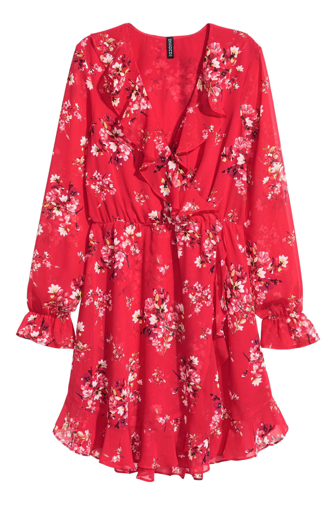

# DressCode
This repository contains code that performs a **catalogue matching** task on a custom dataset.
## Catalogue Matching
Given the catalogue of a retailer as a dataset of photos, the task is to indentificate which of these objects people are wearing in 
real life photos that we call **queries**.
## The Dataset
The chosen dataset simplfies the task. It consists in all the dresses of the H&M french online catalogue.    
The **real world** photos consists in the models that wear the items. You get associations like these:
### Catalogue Item

### Corresponding Model (Query)

### Getting the dataset
To get get the dataset you should execute *get_dataset.py* with python3.   
It will download the catalogue items in **db/robes/cat/** and the corresponding models in **db/robes/mod/**.   
At the time the experiment was made it consisted in 210 items, the photos are of good quality the whole takes about **200Mo**.    
**Important:** if you want to re-conduct the following results you should check that the variable **to_ignore** is still 
adequate to the DB. This variable stores ill-formed examples (where no models wear the item or ill formated jpg files).   
There were 10 such items when the experiment was made.   
## Results   
The results are gathered in 3 notebooks:   
-Results 1: Achieves 30% at 10-accuracy   
-Results 2:      
-Results 3:   

All these methods rely on the same **features extractor** namely the network **inception v3** used with the TensorFlow framework.    
These methods are evaluated according to the **10-accuracy** measure: each query's corresponding iem has to appear in the top 10 of the
method's output to be considered as well classified.      
All the notebook contains explantions about the method used, you'll find a summary just after.   
###Feature Extraction   
The **inception v3** network is the feature extractor, it is used with TensorFlow.    
The model should be put in the **models** file, you can follow this tutorial to download it:    
https://www.kernix.com/blog/image-classification-with-a-pre-trained-deep-neural-network_p11    
Routines from this article can be found in the code.    
###Results 1
It implements the simplest way a feature extractor could be used: just compare features of the catalogue directly with those of the queries.   
It achieve a 30% 10-accuracy. It is not good because it does not *look where it should*.
