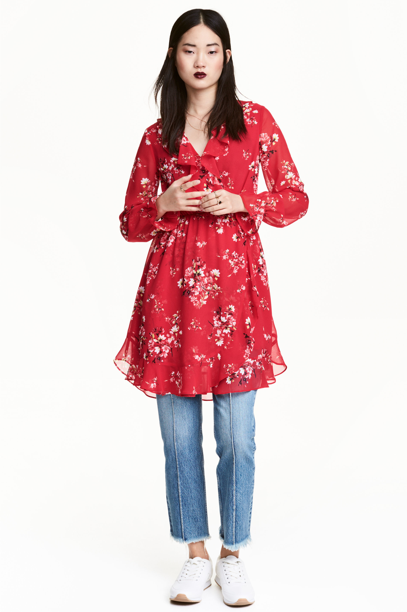

# DressCode
This repository contains code that performs a **catalogue matching** task on a custom dataset.
## Catalogue Matching
Given the catalogue of a retailer as a dataset of photos, the task is to indentificate which of these objects people are wearing in 
real life photos that we call **queries**.
## The Dataset
The chosen dataset simplfies the task. It consists in all the dresses of the H&M french online catalogue.    
The **real world** photos consists in the models that wear the items. You get associations like these:
### Catalogue Item

### Corresponding Model (Query)

### Getting the dataset
To get get the dataset you should execute *get_dataset.py* with python3.   
It will download the catalogue items in **db/robes/cat/** and the corresponding models in **db/robes/mod/**.   
At the time the experiment was made it consisted in 210 items, the photos are of good quality the whole takes about **200Mo**.    
**Important:** if you want to re-conduct the following results you should check that the variable **to_ignore** is still 
adequate to the DB. This variable stores ill-formed examples (where no models wear the item or ill formated jpg files).   
There were 10 such items when the experiment was made.   
## Results   
The results are gathered in 3 notebooks:   
-Results 1, "Take All": Achieves **30%** at 10-accuracy   
-Results 2, "Centered Crop": Achieves **51%** at 10-accuracy     
-Results 3, "Refined Crops": Achieves **71%** at 10-accuracy

All these methods rely on the same **features extractor** namely the network **inception v3** used with the TensorFlow framework.    
These methods are evaluated according to the **10-accuracy** measure: each query's corresponding iem has to appear in the top 10 of the
method's output to be considered as well classified.      
All the notebook contains explantions about the method used, you'll find a summary just after.   
###Feature Extraction   
The **inception v3** network is the feature extractor, it is used with TensorFlow.    
The model should be put in the **models** file, you can follow this tutorial to download it:    
https://www.kernix.com/blog/image-classification-with-a-pre-trained-deep-neural-network_p11    
Routines from this article can be found in the code.    
###Results 1, "Take All"
It implements the simplest way a feature extractor could be used: just compare features of the catalogue directly with those of the queries.   
It achieve a 30% 10-accuracy. It is not good because it does not *look where it should*.
###Results 2, "Centered Crop"   
The first idea to **look where it should** is that, because this dataset presents only **centered** photos, useful information
in the query has a good probability to be around the center.   
So the queries are first croped in their center before their features are computed.   
These crops are still compared to the entire items in the catalogue.      
It gives a **51%** 10-accuracy.   
It is better but it may not look were it should either, maybe the relevant information is not in the center of the query. Also the catalogue item should be croped for better results.     
###Results 3, "Refined Crops"
The structure of our photos is quite simple.     
Each photo of the catalogue is divided into tiles on a 4x5 grid, the useful information is to be found in two tiles, (1,2) and (2,2). The same kind of heuristic is used to isolate information with queries.     
Thus each catalogue item and query give 2 feature vectors.  
For a query each catalogue item is ranked according the best matcher among these 4 feature vectors.    
This method gives a **71%** 10-accuracy.
This **hand-made** heuristic to crop the images of this dataset can be justified in our application setting:   
-The retailer can make the relevant crops when it builds its catalogue    
-The user can zoom over what interests him when he make the query    
However this example emphasizes the **importance of selecting relevant part of the clothes**, wether it is done by hand or automatically.   
Methods in the spirit of "Points of Interets" as used in SIFT descriptors could be used to get rid of this hand-crafted dataset
specific part of the method.    
Enventually to handle more crops efficiently in memory, techniques such as **memory vectors** could be used.    